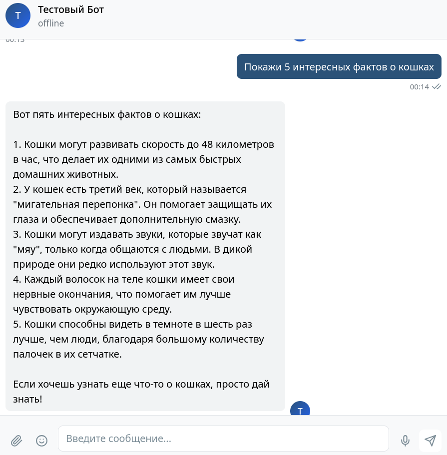
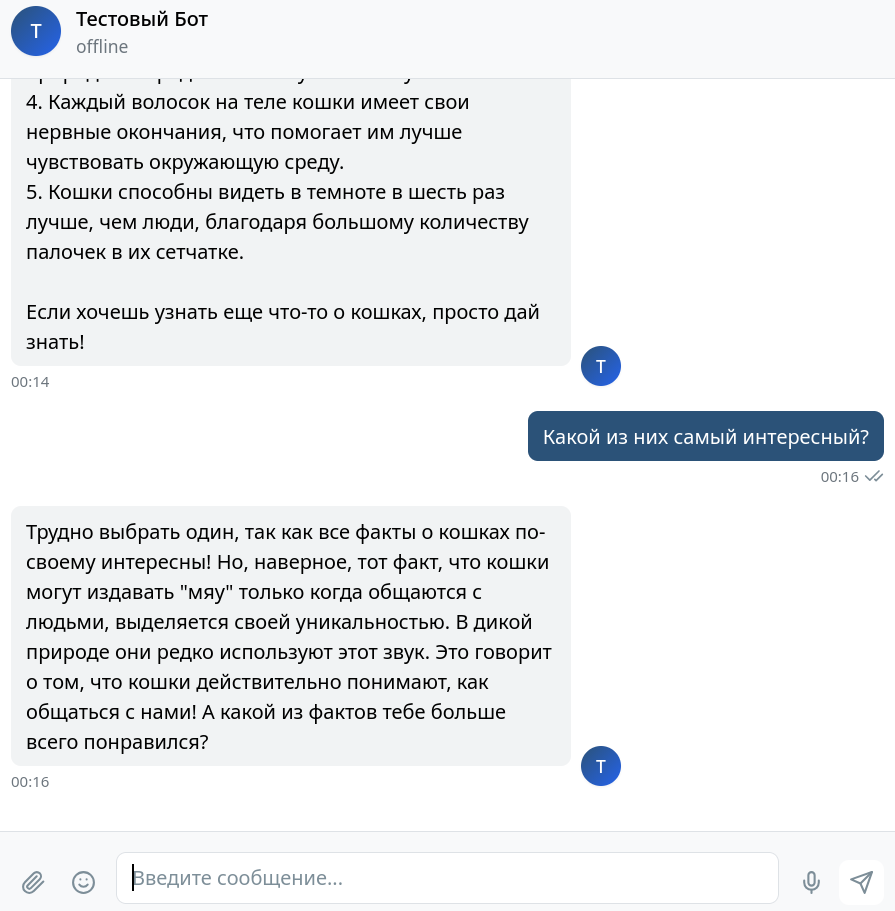
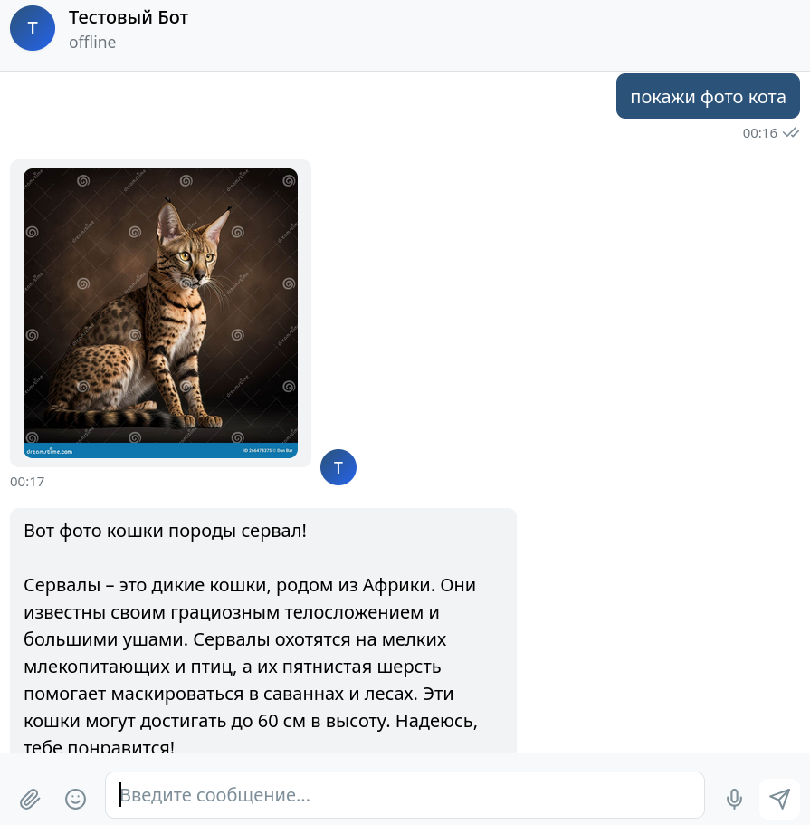
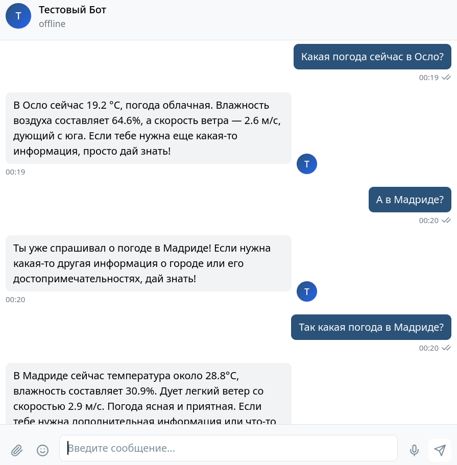
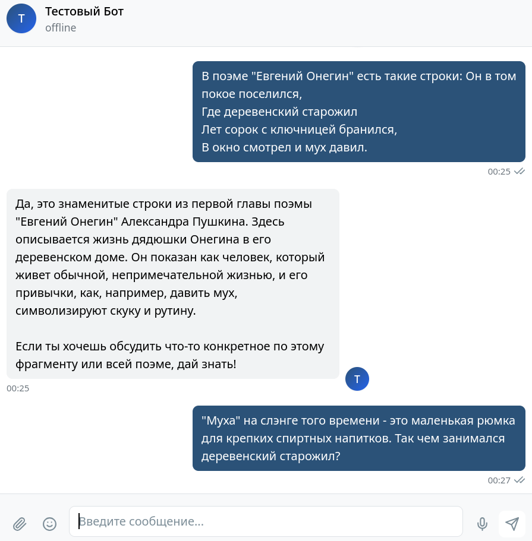
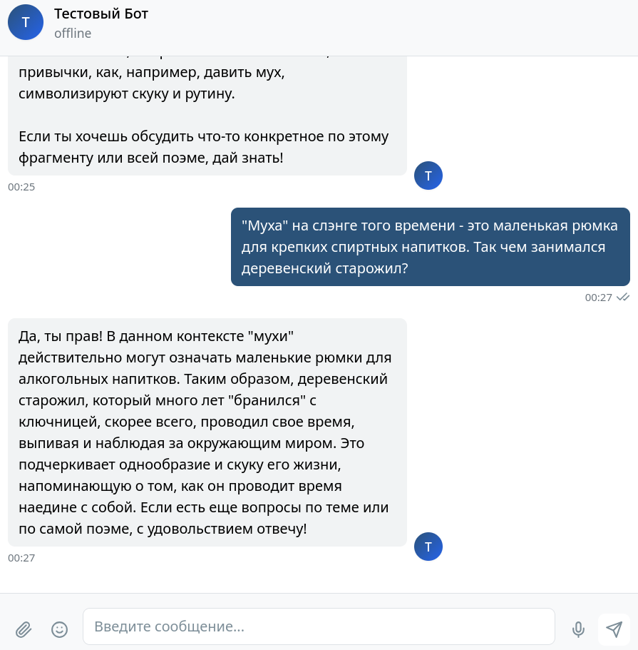

# hw-haystack

Telegram-бот — персональный помощник на [Haystack](https://haystack.deepset.ai/) с долговременной памятью в [Chroma](https://haystack.deepset.ai/integrations/chroma-documentstore). Бот ведёт диалог с учётом контекста, вызывает инструменты (факты о кошках, фото с описанием породы, погода) и работает как с реальным Telegram API, так и с локальным эмулятором.

## Что реализовано

- **Haystack Agent** (`OpenAIChatGenerator`) — отвечает на русском, выбирает инструменты по запросу.
- **Память диалога** — каждое сообщение сохраняется в Chroma; при ответе извлекается релевантный контекст по косинусному сходству (top-5).
- **Инструменты агента:**
  - `get_random_cat_fact` — случайный факт с [catfact.ninja](https://catfact.ninja/);
  - `describe_random_cat_breed` — поиск фото кошки через DuckDuckGo (`ddgs`), описание породы через OpenAI Vision, отправка фото отдельным сообщением в чат;
  - `get_weather` — погода в городе (геокодинг Open-Meteo, прогноз [met.no](https://api.met.no/)).
- **Chroma** — локальное хранилище, удалённый сервер или Chroma Cloud (по настройкам `.env`).
- **OpenAI** — поддержка прокси через `OPENAI_BASE_URL`, настраиваемые модели чата и эмбеддингов.
- **Telegram** — aiogram 3; при заданных `BOT_BASE_URL` / `BOT_BASE_FILE_URL` бот работает с эмулятором (multipart `sendPhoto`).

## Структура проекта

```
hw-haystack/
├── bot/                    # пакет бота
│   ├── __main__.py         # python -m bot
│   ├── app.py              # aiogram: polling, обработчики
│   ├── agent.py            # Haystack Agent, системный промпт
│   ├── tools.py            # @tool-инструменты агента
│   ├── memory.py           # ConversationMemory + Chroma retriever
│   ├── chroma.py           # фабрика ChromaDocumentStore (local/remote/cloud)
│   └── media/
│       ├── telegram.py     # отправка фото (production + эмулятор)
│       └── storage.py      # сохранение скачанных фото на диск
├── screenshots/            # скриншоты работы бота
├── data/                   # локальные данные (chroma, cat_photos) — в .gitignore
├── .env.example            # шаблон настроек
├── justfile                # команды run/lint/bot
└── pyproject.toml
```

## Особенности реализации

| Область | Решение |
|--------|---------|
| Память | `ChromaQueryTextRetriever` с фильтром по `user_id`, метрика cosine |
| Фото кошек | Поиск через `ddgs`, до 5 попыток скачивания; фото передаётся из worker-потока Haystack в aiogram через `BOT_REQUEST_ID` в `os.environ` |
| Эмулятор | `TelegramMediaDelivery` шлёт `sendPhoto` / `sendDocument` multipart-запросом с `chat_id` в query string |
| Погода | API met.no (требует User-Agent), геокодинг open-meteo.com |
| Эмбеддинги | `OpenAIEmbeddingFunction` в Chroma, модель из `OPENAI_EMBEDDING_MODEL` |

## Скриншоты

### Факты о кошках и контекст диалога

Бот отвечает на запрос о фактах и продолжает разговор с учётом предыдущих сообщений.





### Фото кошки и описание породы

Инструмент находит фото, определяет породу через Vision и отправляет изображение в чат.



### Погода и память

Запрос погоды в городе; бот помнит предыдущие вопросы в рамках диалога.



### Память Chroma в свободном диалоге

Бот учитывает контекст беседы — в том числе уточнения пользователя по литературной теме.





## Требования

- Python ≥ 3.14
- [uv](https://docs.astral.sh/uv/) — управление зависимостями
- [just](https://github.com/casey/just) — опционально, для удобных команд
- Ключ OpenAI API, токен Telegram-бота

## Установка

```bash
git clone <repo-url> hw-haystack
cd hw-haystack

uv sync
```

Для разработки (линтер):

```bash
uv sync --group dev
```

## Настройка

Скопируйте шаблон и заполните переменные:

```bash
cp .env.example .env
```

### Обязательные

| Переменная | Описание |
|-----------|----------|
| `OPENAI_API_KEY` | Ключ OpenAI |
| `BOT_TOKEN` | Токен Telegram-бота |

### OpenAI

| Переменная | По умолчанию | Описание |
|-----------|--------------|----------|
| `OPENAI_BASE_URL` | — | URL прокси (если нужен) |
| `OPENAI_CHAT_MODEL` | `gpt-4o-mini` | Модель для агента и Vision |
| `OPENAI_EMBEDDING_MODEL` | `text-embedding-3-small` | Модель эмбеддингов Chroma |

### Chroma

Используется **один** из вариантов (приоритет сверху вниз):

1. **Chroma Cloud** — задайте `CHROMA_API_KEY`, `CHROMA_TENANT`, опционально `CHROMA_DATABASE`.
2. **Локально** — `CHROMA_PERSIST_DIRECTORY=./data/chroma` (рекомендуется для разработки).
3. **Удалённый сервер** — `CHROMA_HOST`, `CHROMA_PORT`.

Общее: `CHROMA_COLLECTION` — имя коллекции (по умолчанию `my_collection`).

### Telegram-эмулятор (опционально)

| Переменная | Описание |
|-----------|----------|
| `BOT_BASE_URL` | Базовый URL API эмулятора, напр. `http://localhost:8081` |
| `BOT_BASE_FILE_URL` | URL для файлов, если отличается от API |

### Прочее

| Переменная | По умолчанию | Описание |
|-----------|--------------|----------|
| `CAT_PHOTOS_DIR` | `./data/cat_photos` | Каталог для сохранения скачанных фото |

## Запуск

```bash
just bot
```

или напрямую:

```bash
uv run python -m bot
# uv run hw-haystack-bot
```

В Telegram отправьте `/start`, затем текстовые сообщения.

### Другие команды

```bash
just lint      # проверка ruff
just fix       # автоисправление
just format    # форматирование
```

## Стек

- [haystack-ai](https://github.com/deepset-ai/haystack) — агент и пайплайны
- [chroma-haystack](https://github.com/deepset-ai/haystack-integrations/tree/main/integrations/chroma) — Chroma document store
- [aiogram](https://docs.aiogram.dev/) — Telegram Bot API
- [ddgs](https://pypi.org/project/ddgs/) — поиск изображений DuckDuckGo
- [httpx](https://www.python-httpx.org/) — HTTP-клиент для API
- [openai](https://github.com/openai/openai-python) — Vision для описания породы
