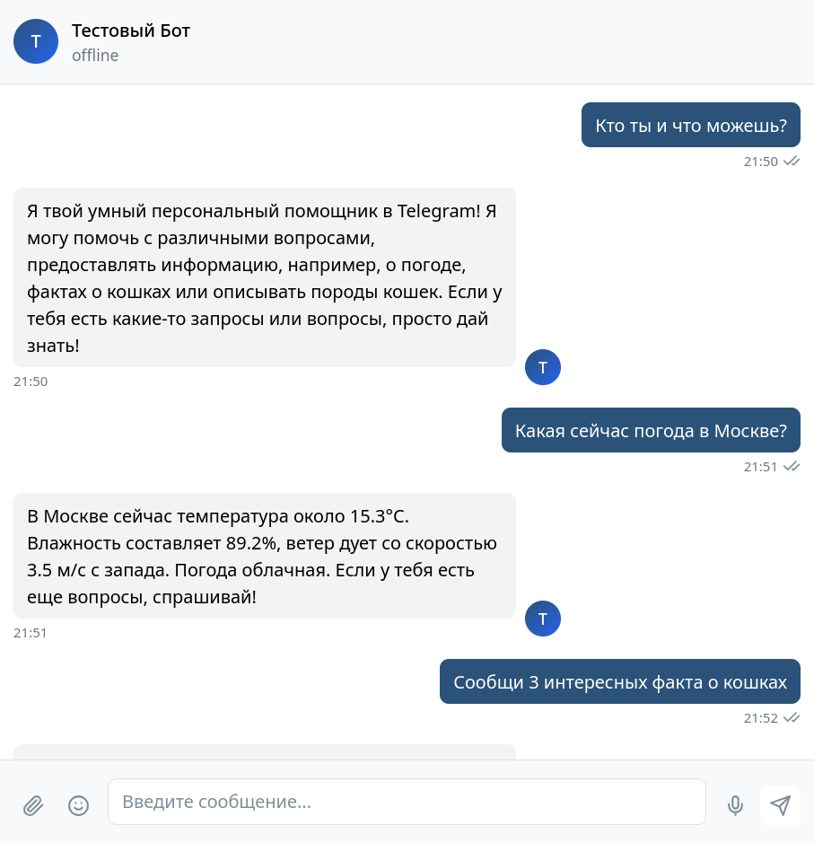
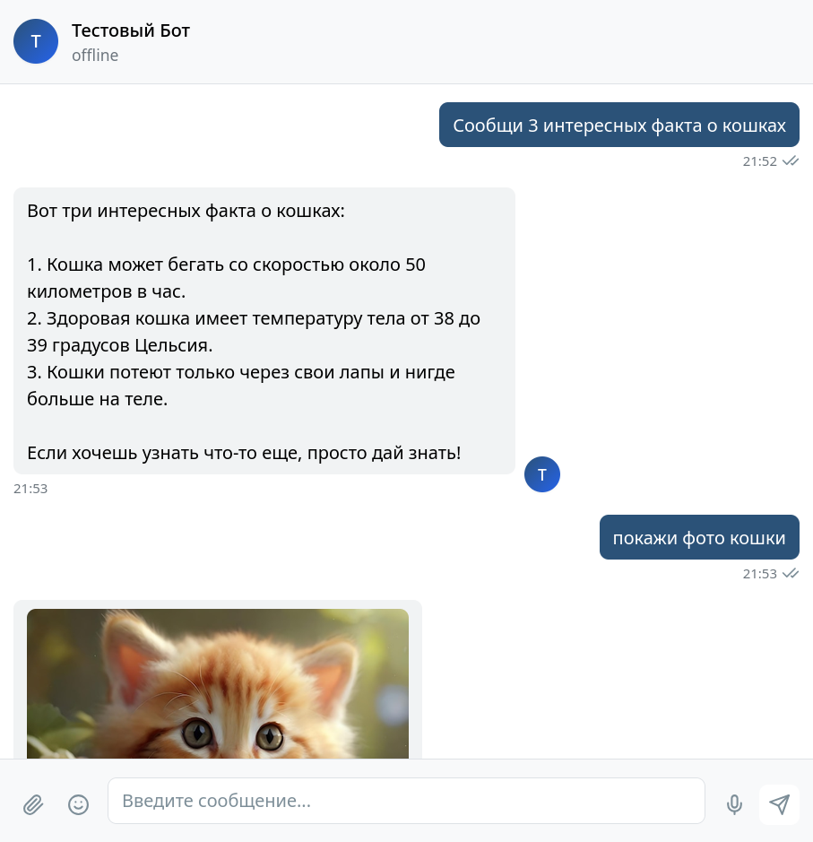
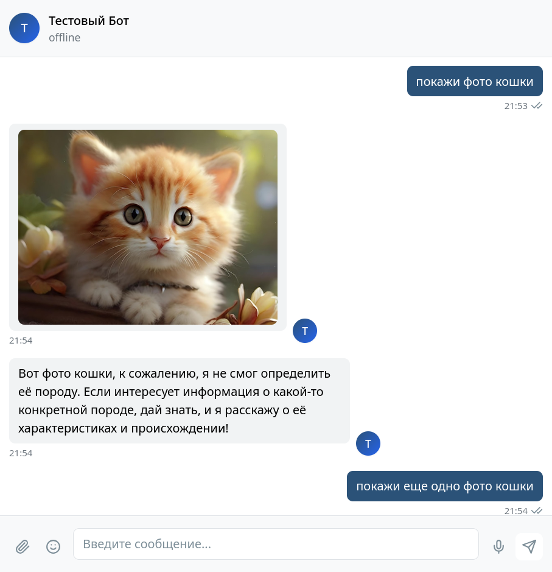
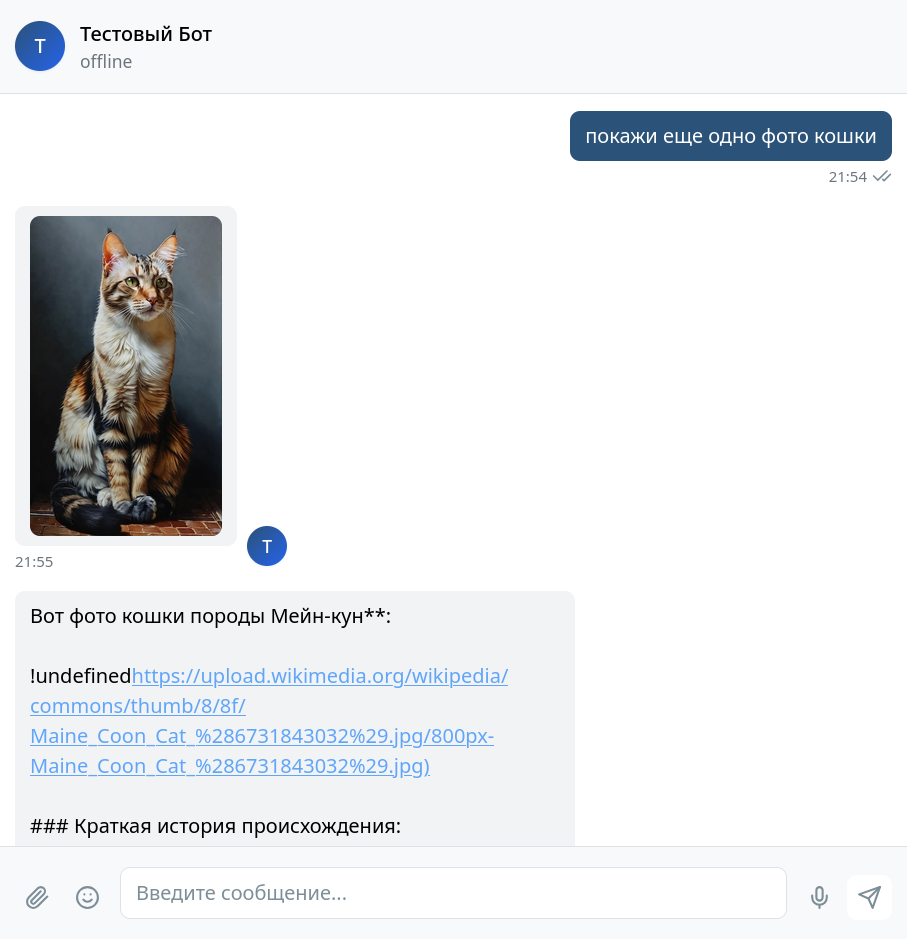
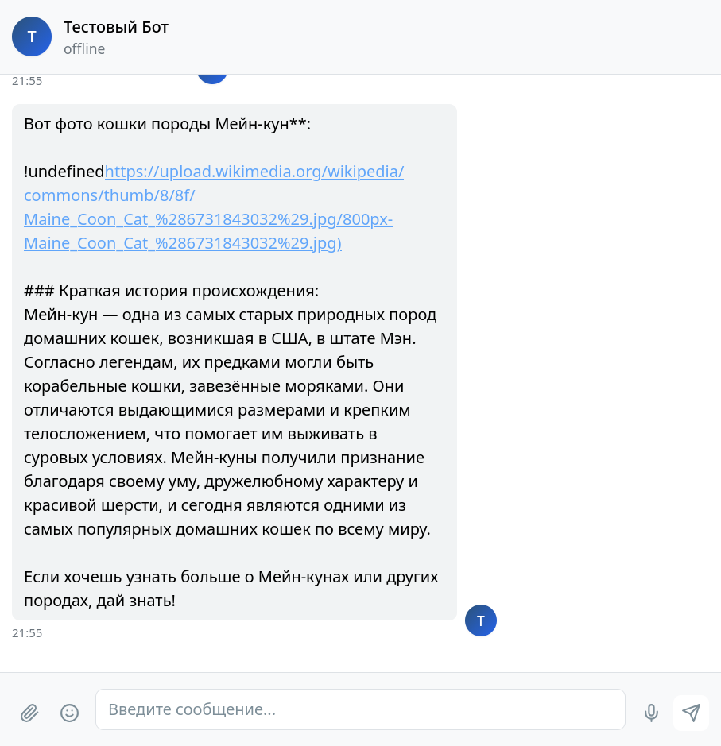
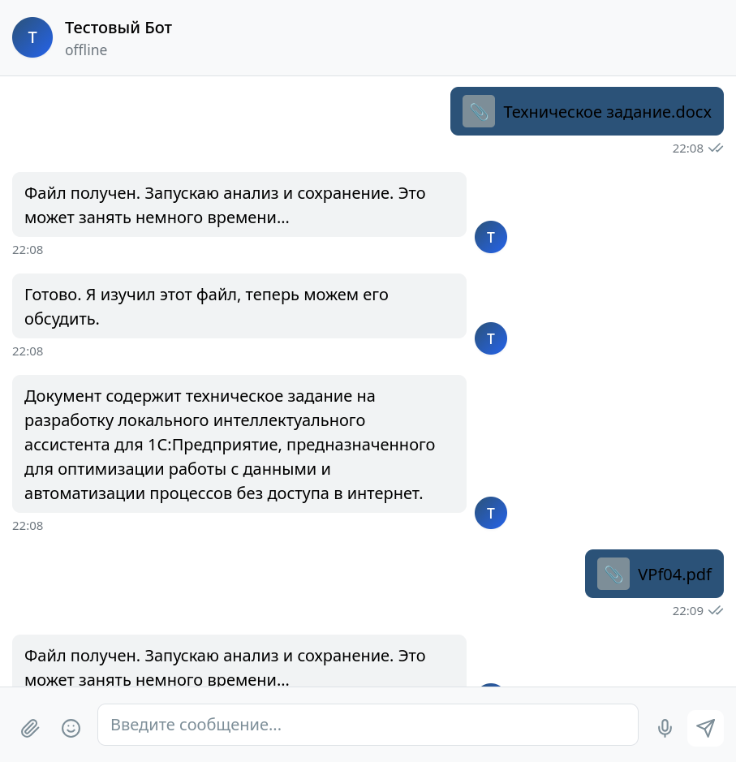
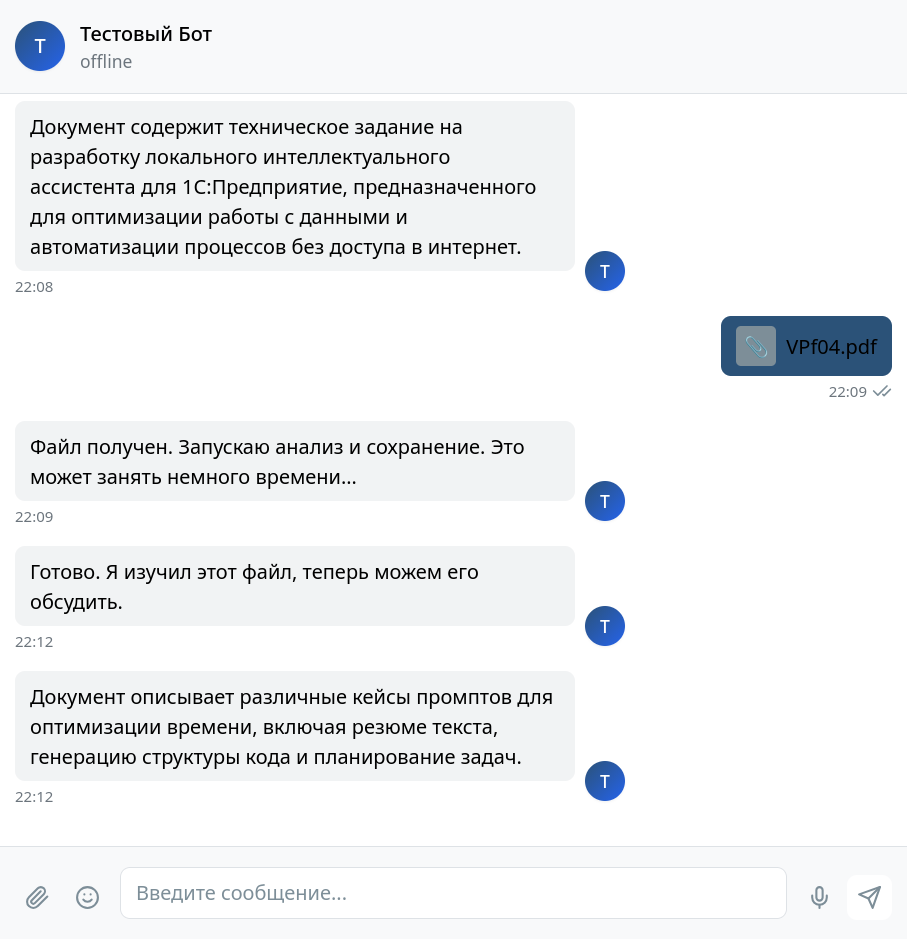
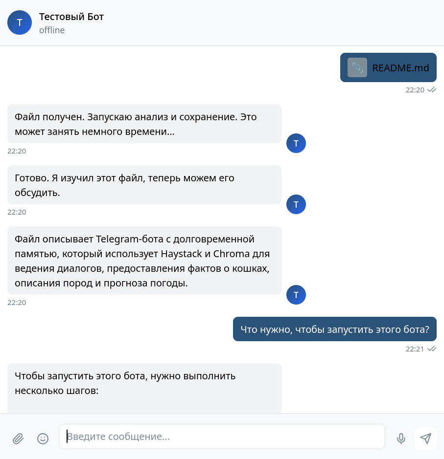
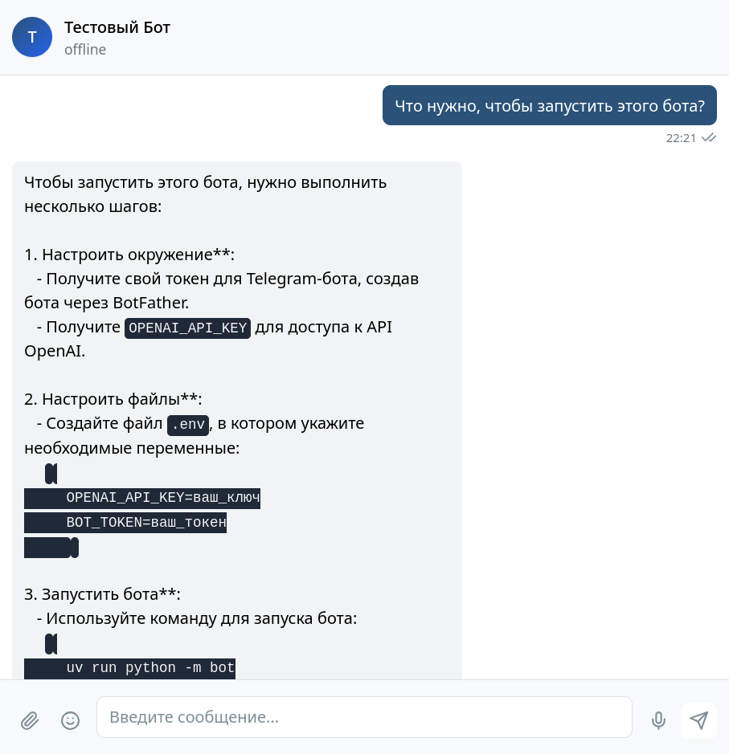

# hw-haystack — bot v2

Вторая версия Telegram-бота: модульная архитектура на [Haystack](https://haystack.deepset.ai/) с пайплайнами ingestion и generation, долговременной памятью в [Chroma](https://haystack.deepset.ai/integrations/chroma-documentstore) и обработкой документов через [DocLing](https://haystack.deepset.ai/docs/doclingconverter).

Первая версия (`bot/`) описана в [README_v1.md](README_v1.md). Версия v2 полностью повторяет её возможности и добавляет загрузку файлов (PDF, DOCX и др.) с сохранением в векторную базу и ответами по содержимому документов.

## Что реализовано

### Наследие от v1

- **Haystack Agent** с инструментами:
  - `get_random_cat_fact` — факты с [catfact.ninja](https://catfact.ninja/);
  - `describe_random_cat_breed` — фото кошки через DuckDuckGo (`ddgs`), описание породы через OpenAI Vision, отправка фото отдельным сообщением;
  - `get_weather` — погода (геокодинг Open-Meteo, прогноз [met.no](https://api.met.no/)).
- **Память диалога** — сообщения сохраняются в Chroma, при ответе извлекается релевантный контекст (cosine, top-5).
- **Telegram** — aiogram 3, поддержка эмулятора (`BOT_BASE_URL`, `BOT_BASE_FILE_URL`).

### Новое в v2

- **Модульная архитектура** — отдельный пакет `bot_v2/` без зависимостей от `bot/`.
- **ingestion_pipeline** — DocLing разбивает файл на чанки, обогащает метаданными (`filename`, `chunk_index`, `page`, `user_id`) и пишет в Chroma.
- **generation_pipeline** — retriever по загруженным документам + память диалога + Haystack Agent.
- **Обработка файлов** — PDF, DOCX, DOC, PPTX, XLSX, HTML, MD, TXT, CSV; после загрузки бот отправляет статус, однострочное резюме и готов обсуждать содержимое.
- **Отдельные данные** — каталог `data_v2/` (Chroma, uploads, cat_photos).

## Структура проекта

```
hw-haystack/
├── bot_v2/                     # вторая версия бота
│   ├── __main__.py             # python -m bot_v2
│   ├── components/             # Haystack-компоненты
│   │   ├── chroma.py           # ChromaDocumentStore (data_v2)
│   │   ├── memory.py           # память диалога
│   │   ├── document_retriever.py
│   │   ├── enricher.py         # метаданные чанков после DocLing
│   │   ├── summarizer.py       # резюме в одно предложение
│   │   ├── tools/              # инструменты агента (как в v1)
│   │   └── media/              # фото, отправка в Telegram
│   ├── pipelines/
│   │   ├── ingestion.py        # DocLing → Chroma → резюме
│   │   └── generation.py       # retriever + Agent
│   └── bot/
│       ├── app.py              # aiogram: текст и документы
│       ├── config.py           # настройки и пути data_v2
│       ├── downloads.py        # скачивание файлов (в т.ч. эмулятор)
│       └── telegram.py         # создание Bot
├── bot/                        # первая версия (см. README_v1.md)
├── data_v2/                    # локальные данные v2 — в .gitignore
├── screenshots/                # скриншоты v2-chat-*.png
├── .env.example
├── justfile
└── pyproject.toml
```

## Логика работы

### Текстовые сообщения

1. Пользователь отправляет текст.
2. Запускается `generation_pipeline`:
   - retriever ищет релевантные чанки загруженных документов;
   - retriever извлекает контекст диалога;
   - Haystack Agent формирует ответ с учётом обоих контекстов и при необходимости вызывает инструменты.
3. Бот отправляет ответ (и фото кошки, если сработал инструмент породы).

### Загрузка файлов

1. Пользователь отправляет документ.
2. Бот: «Файл получен. Запускаю анализ и сохранение. Это может занять немного времени…»
3. Файл скачивается в `data_v2/uploads/`, запускается `ingestion_pipeline` (DocLing → enricher → Chroma).
4. Бот: «Готово. Я изучил этот файл, теперь можем его обсудить.»
5. Бот отправляет **одно предложение** — краткое резюме содержимого.

## Особенности реализации

| Область | Решение |
|--------|---------|
| Разделение данных | Отдельная коллекция Chroma (`CHROMA_V2_COLLECTION`) и каталог `data_v2/` |
| Метаданные чанков | `source_type=document`, `filename`, `chunk_index`, `page` (если есть) |
| Память диалога | `source_type=conversation`, фильтр по `user_id` |
| DocLing | `ExportType.DOC_CHUNKS`, пакет `docling-haystack` |
| Резюме файла | `PromptBuilder` + `OpenAIGenerator`, ровно одно предложение |
| Эмулятор Telegram | Скачивание файлов по URL `/file/bot{token}/{file_id}` (без `getFile`) |
| Фото кошек | Механизм `BOT_V2_REQUEST_ID` для передачи фото из потока Haystack в aiogram |

## Скриншоты

### Знакомство, погода и факты о кошках

Бот представляется, отвечает на запрос погоды в Москве и выдаёт факты о кошках.





### Фото кошки и описание породы

Поиск фото, Vision-описание породы (Мейн-кун), отправка изображения в чат.







### Загрузка и анализ документов

Обработка DOCX и PDF: статус, сохранение в Chroma, однострочное резюме.





### Вопросы по загруженному файлу

После загрузки `README.md` бот отвечает на вопросы по его содержимому.





## Требования

- Python ≥ 3.14
- [uv](https://docs.astral.sh/uv/) — управление зависимостями
- [just](https://github.com/casey/just) — опционально
- Ключ OpenAI API, токен Telegram-бота

## Установка

```bash
git clone <repo-url> hw-haystack
cd hw-haystack

uv sync
```

Для разработки:

```bash
uv sync --group dev
```

## Настройка

```bash
cp .env.example .env
```

### Обязательные

| Переменная | Описание |
|-----------|----------|
| `OPENAI_API_KEY` | Ключ OpenAI |
| `BOT_TOKEN` | Токен Telegram-бота |

### OpenAI

| Переменная | По умолчанию | Описание |
|-----------|--------------|----------|
| `OPENAI_BASE_URL` | — | URL прокси (если нужен) |
| `OPENAI_CHAT_MODEL` | `gpt-4o-mini` | Модель для агента, Vision и резюме |
| `OPENAI_EMBEDDING_MODEL` | `text-embedding-3-small` | Модель эмбеддингов Chroma |

### Chroma и данные v2

| Переменная | По умолчанию | Описание |
|-----------|--------------|----------|
| `BOT_V2_DATA_DIR` | `./data_v2` | Корневой каталог данных v2 |
| `CHROMA_V2_PERSIST_DIRECTORY` | `./data_v2/chroma` | Локальное хранилище Chroma |
| `CHROMA_V2_COLLECTION` | `bot_v2_collection` | Имя коллекции |
| `BOT_V2_UPLOADS_DIR` | `./data_v2/uploads` | Временное хранение загруженных файлов |
| `BOT_V2_CAT_PHOTOS_DIR` | `./data_v2/cat_photos` | Скачанные фото кошек |

Для Chroma Cloud можно использовать общие переменные `CHROMA_API_KEY`, `CHROMA_TENANT`, `CHROMA_DATABASE` (см. `.env.example`).

### Telegram-эмулятор (опционально)

| Переменная | Описание |
|-----------|----------|
| `BOT_BASE_URL` | Базовый URL API эмулятора, напр. `http://localhost:8081` |
| `BOT_BASE_FILE_URL` | URL для файлов, если отличается от API |

## Запуск

```bash
just bot-v2
```

или напрямую:

```bash
uv run python -m bot_v2
# uv run hw-haystack-bot-v2
```

В Telegram: `/start`, затем текстовые сообщения или документы.

Первая версия бота запускается отдельно: `just bot` (см. [README_v1.md](README_v1.md)).

### Другие команды

```bash
just lint      # проверка ruff
just fix       # автоисправление
just format    # форматирование
```

## Стек

- [haystack-ai](https://github.com/deepset-ai/haystack) — агент и пайплайны
- [docling-haystack](https://github.com/docling-project/docling-haystack) — парсинг и чанкинг документов
- [chroma-haystack](https://github.com/deepset-ai/haystack-integrations/tree/main/integrations/chroma) — векторное хранилище
- [aiogram](https://docs.aiogram.dev/) — Telegram Bot API
- [ddgs](https://pypi.org/project/ddgs/) — поиск изображений DuckDuckGo
- [httpx](https://www.python-httpx.org/) — HTTP-клиент
- [openai](https://github.com/openai/openai-python) — Vision и чат
